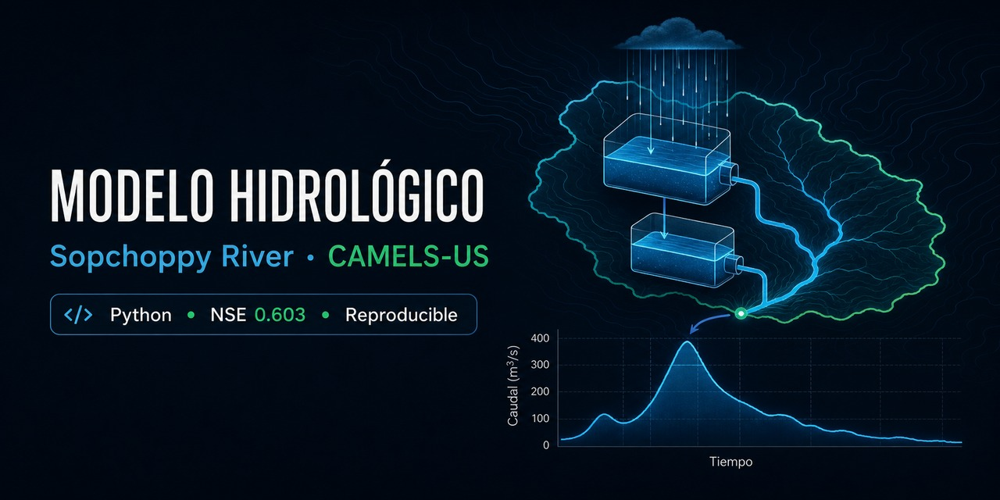
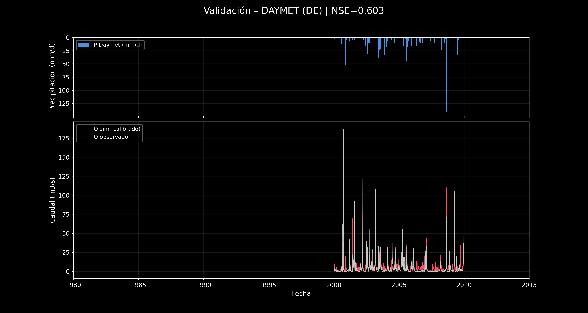

# Modelo hidrológico lluvia-escorrentía · Sopchoppy River


[](https://github.com/CamiloBedoyaC/modelo-hidrologico-sopchoppy/actions/workflows/reproducibility.yml)
[](https://camilobedoyac.github.io/modelo-hidrologico-sopchoppy/)

**Autores:** [Juan Camilo Bedoya Carmona](https://github.com/CamiloBedoyaC)
([`@CamiloBedoyaC`](https://github.com/CamiloBedoyaC))  y 
[Linda Catalina Correa Lozano](https://github.com/LindaCatalina)
([`@LindaCatalina`](https://github.com/LindaCatalina))

**Cuenca:** USGS 02327100 · SOPCHOPPY RIVER NR SOPCHOPPY, FLA.



Proyecto de modelación hidrológica conceptual que implementa, calibra y valida
un modelo de dos tanques. Compara fuentes meteorológicas (Daymet y NLDAS),
optimizadores globales (Differential Evolution y Dual Annealing) y dos
estrategias de calibración: ajuste global con NSE y representación de crecidas
mediante una función objetivo compuesta `J`.

> **Empieza aquí:** abre
> [`informe/reporte_tarea1_interactivo.html`](informe/reporte_tarea1_interactivo.html)
> o el sitio de GitHub Pages generado desde [`index.html`](index.html).



## Resultados destacados

- Mejor desempeño estándar: **Daymet + DE**, con `NSE_val = 0.603`.
- El forzamiento Daymet generaliza mejor que NLDAS en 2000-2009.
- El balance hídrico cierra con residuales acumulados del orden de `10^-12 mm`.
- La calibración orientada a extremos mejora el ajuste relativo de crecidas,
  pero reduce el NSE global: evidencia un trade-off estructural.
- Las semillas y versiones están fijadas; las métricas se recalculan
  automáticamente con tolerancia `1e-9`.

## Requisitos

- Python **3.12** (entorno probado: Python 3.12.10).
- Conexión a Internet para descargar CAMELS-US y para las librerías/teselas de
  los HTML interactivos.
- Aproximadamente 4 GB libres si se ejecuta la descarga completa.
- Opcional para recompilar el PDF: MiKTeX/TeX Live (`pdflatex`) o Tectonic en
  `PATH`.

Las dependencias directas están documentadas en `codigo/requirements.txt` y el
entorno completo, incluidas las dependencias transitivas, está fijado en
`codigo/requirements-lock.txt`.

### Crear el entorno

Desde la raíz del proyecto:

```bash
python -m venv .venv
```

En Windows, si el comando `python` abre Microsoft Store o no se encuentra, usa:

```powershell
py -3.12 -m venv .venv
```

Activación en Windows PowerShell:

```powershell
.\.venv\Scripts\Activate.ps1
```

Activación en macOS/Linux:

```bash
source .venv/bin/activate
```

Instalación en cualquier sistema:

```bash
python -m pip install --upgrade pip
python -m pip install -r requirements.txt
```

## Reproducción

### Opción A · Verificación rápida, sin datos crudos

El repositorio incluye únicamente los insumos procesados pequeños de la cuenca
y los resultados finales. Para comprobar datos, conversiones, parámetros,
NSE, `J`, balance, enlaces HTML y PDF:

```bash
python -m unittest discover -s tests -v
python -X utf8 codigo/verificar_reproducibilidad.py
```

Para regenerar estadísticas, modelo no calibrado, dashboards, gráficos de
calibración a partir de las tablas existentes y el standalone:

```bash
python -X utf8 codigo/reproducir_todo.py --omitir-calibracion --omitir-pdf
```

Esta ruta no necesita `datos/raw/`.

### Opción B · Reproducción completa desde CAMELS-US

```bash
python -X utf8 codigo/reproducir_todo.py --desde-cero
```

El orquestador ejecuta, en orden:

1. Descarga de atributos y límites de cuencas.
2. Exploración global CAMELS y mapa Leaflet.
3. Descarga del ZIP hidrometeorológico de aproximadamente 3.4 GB.
4. Extracción y preprocesamiento exclusivo de la cuenca 02327100.
5. Exploración diaria/mensual y estadísticas básicas.
6. Modelo no calibrado y auditoría del balance.
7. Calibración estándar y orientada a extremos.
8. Hidrogramas combinados, FDC y dispersión de validación.
9. Reporte standalone, PDF y auditoría final.

Los datos crudos quedan en `datos/raw/` y están excluidos de Git. Las fuentes,
DOI y checksums están en [`DATA_SOURCES.md`](DATA_SOURCES.md).

## Ejecución manual por etapas

Si se prefiere controlar cada paso, ejecutar desde la raíz:

| Orden | Comando | Salidas principales |
|---:|---|---|
| 1 | `python -X utf8 codigo/descargar_camels.py --attributes-only --shapes` | `datos/raw/camels_*.txt`, atributos y límites |
| 2 | `python -X utf8 codigo/explorar_camels.py --gauge 02327100` | scatter plots, heatmap y `datos/atributos.csv` |
| 3 | `python -X utf8 codigo/mapa_cuenca_leaflet.py --gauge 02327100` | mapa HTML y GeoJSON/KML de la cuenca |
| 4 | `python -X utf8 codigo/descargar_camels.py --all` | ZIP de forzamientos y caudal |
| 5 | `python -X utf8 codigo/preprocesar_02327100.py --gauge 02327100` | `forzamiento.csv`, `caudal.csv`, serie integrada |
| 6 | `python -X utf8 codigo/explorar_datos.py --gauge 02327100 --precip prcp_daymet_mm_day` | series, ciclo anual, comparación y estadísticas |
| 7 | `python -X utf8 codigo/ejecutar_modelo.py --gauge 02327100 --sources daymet nldas` | salidas no calibradas y balance |
| 8 | `python -X utf8 codigo/dashboard_balance.py --gauge 02327100` | Sankey, curva de masa y heatmap |
| 9 | `python -X utf8 codigo/calibrar.py --gauge 02327100 --sources daymet nldas --methods de da --n-seeds 3 --maxiter 40 --popsize 12` | calibración estándar DE/DA |
| 10 | `python -X utf8 codigo/calibrar_extremos.py --gauge 02327100 --sources daymet nldas --methods de da --n-seeds 1 --maxiter 8 --popsize 8` | calibración de extremos |
| 11 | `python -X utf8 codigo/replot_calibrados.py` | cuatro HTML con selector DA/DE |
| 12 | `python -X utf8 codigo/diagnostico_validacion.py --gauge 02327100` | FDC y dispersión observada-simulada |
| 13 | `python -X utf8 codigo/generar_reporte_standalone.py` | reporte de un solo archivo |
| 14 | `python -X utf8 codigo/compilar_pdf.py` | `informe/reporte_tarea1.pdf` |
| 15 | `python -X utf8 codigo/verificar_reproducibilidad.py --write-audits` | auditorías recalculadas |

`codigo/generar_reportes.py` conserva una plantilla histórica y **no
sobrescribe** los informes por defecto. El HTML y el TeX actuales son fuentes
curadas; así se evitan pérdidas accidentales de textos editados.

## Métodos de calibración

- **Differential Evolution (DE):** optimización global poblacional.
- **Dual Annealing (DA):** recocido global con refinamiento local.
- **Objetivo estándar:** maximizar NSE, implementado como minimización de
  `-NSE`.
- **Objetivo de extremos:** minimizar
  `J = 0.5(1-NSE_all) + 0.3(1-NSE_high) + 0.2 PeakBias + 0.2 UnderHigh`.
- **Warm-up:** 365 días; excluido de métricas.
- **Calibración:** 1990-01-01 a 1999-12-31.
- **Validación:** 2000-01-01 a 2009-12-31.
- **Semillas:** `100, 101, 102` en estándar y `100` en extremos.

## Resultados principales

### Estadísticas básicas

| variable | unidades | N | faltantes | media | desv. est. | máximo | P25 | P75 |
|---|---:|---:|---:|---:|---:|---:|---:|---:|
| prcp_daymet_mm_day | mm/d | 12784 | 0 | 4.186 | 10.156 | 141.590 | 0.000 | 2.888 |
| prcp_nldas_mm_day | mm/d | 12784 | 0 | 4.064 | 9.883 | 160.860 | 0.000 | 3.500 |
| prcp_maurer_mm_day | mm/d | 10593 | 2191 | 3.975 | 8.568 | 128.260 | 0.000 | 4.150 |
| q_m3s | m³/s | 12697 | 87 | 5.045 | 10.861 | 331.307 | 0.193 | 5.437 |

### Calibración estándar (NSE)

| source | method | NSE_cal | NSE_val | KGE_cal | KGE_val | peak_ratio_val | p95_ratio_val |
|---|---|---:|---:|---:|---:|---:|---:|
| daymet | da | 0.532 | 0.567 | 0.624 | 0.644 | 0.448 | 0.998 |
| daymet | de | 0.550 | **0.603** | 0.610 | 0.616 | 0.587 | 0.865 |
| nldas | da | 0.531 | 0.396 | 0.605 | 0.536 | 0.551 | 0.924 |
| nldas | de | 0.537 | 0.388 | 0.607 | 0.544 | 0.831 | 0.917 |

- Mejor combinación por NSE de validación: **Daymet + DE**.
- Daymet mejora en validación; NLDAS pierde desempeño fuera de calibración.
- `peak_ratio_val` y `p95_ratio_val` son razones Qsim/Qobs; el ideal es 1.

### Calibración orientada a extremos (función objetivo J)

| source | method | J_cal | J_val | NSE_cal | NSE_val | NSE_high_cal | NSE_high_val | PeakBias_val | UnderHigh_val | peak_ratio_val | p95_ratio_val |
|---|---|---:|---:|---:|---:|---:|---:|---:|---:|---:|---:|
| daymet | da | 0.524 | **0.606** | 0.408 | 0.415 | 0.495 | 0.290 | 0.364 | 0.139 | 0.636 | 1.357 |
| daymet | de | 0.524 | 0.606 | 0.407 | 0.414 | 0.496 | 0.291 | 0.364 | 0.138 | 0.636 | 1.359 |
| nldas | da | 0.595 | 0.919 | 0.411 | 0.248 | 0.317 | -0.426 | 0.363 | 0.215 | 0.637 | 1.264 |
| nldas | de | 0.595 | 0.919 | 0.411 | 0.248 | 0.317 | -0.426 | 0.363 | 0.215 | 0.637 | 1.264 |

- Menor `J_val` (mejor): **Daymet + DA**, prácticamente empatado con DE.
- `J` aumenta y NSE cae en validación respecto a calibración.
- Los ratios de pico/P95 se acercan o superan 1, pero el ajuste global disminuye.

## Reportes

En `informe/` se incluyen:

- `reporte_tarea1_interactivo.html`: usa rutas relativas a `figuras/html/`.
- `reporte_tarea1_interactivo_standalone.html`: versión opcional de un solo
  archivo, generada con `codigo/generar_reporte_standalone.py`. No se versiona
  en GitHub porque duplica las visualizaciones y supera 50 MB.
- `reporte_tarea1.pdf`: versión estática de 17 páginas.

El standalone generado incorpora Plotly y los datos de las gráficas, por lo que
todo el contenido analítico funciona sin Internet. Solo el mapa Leaflet necesita
conexión para cargar su librería y las teselas Esri. El PDF funciona
completamente offline.

## Estructura

```text
.
├── codigo/              # modelo, calibración, gráficos y verificadores
├── datos/               # insumos procesados y resultados pequeños
│   ├── 02327100/        # serie integrada y geometría de la cuenca
│   └── raw/             # descarga local; excluida de Git
├── figuras/             # PNG
│   └── html/            # visualizaciones interactivas
├── informe/             # HTML, standalone, TeX y PDF
├── tests/               # pruebas de conservación, límites y continuidad
├── DATA_SOURCES.md      # fuentes, DOI y checksums
├── index.html           # portada para GitHub Pages
└── requirements.txt     # entrada de instalación
```

## Reproducibilidad y portabilidad

- No existen rutas absolutas dependientes del computador.
- Los scripts usan `pathlib` y el mismo intérprete activo (`sys.executable`).
- Las versiones, semillas y configuración de optimización están fijadas.
- El registro se simula continuamente desde 1980; la función objetivo y la
  evaluación comparten exactamente los mismos estados de los tanques.
- Los días sin caudal observado se conservan en la simulación y solo se omiten
  al calcular métricas.
- Los scripts de modelación usan `datos/atributos.csv` si `datos/raw/` no está.
- La descarga se escribe primero como `.part` y valida tamaño/MD5 antes de
  reemplazar el archivo final.
- GitHub Actions ejecuta la auditoría sin descargar datos crudos.

Las métricas y series son reproducibles numéricamente. Los PNG pueden presentar
diferencias mínimas de píxeles entre sistemas por fuentes/renderizado, sin
cambiar resultados ni datos.

## Licencia y datos

El código propio se publica con licencia MIT. CAMELS-US v1.2 declara licencia
`CC BY 4.0` y debe citarse por separado; consulta
[`DATA_SOURCES.md`](DATA_SOURCES.md) y [`CITATION.cff`](CITATION.cff).
